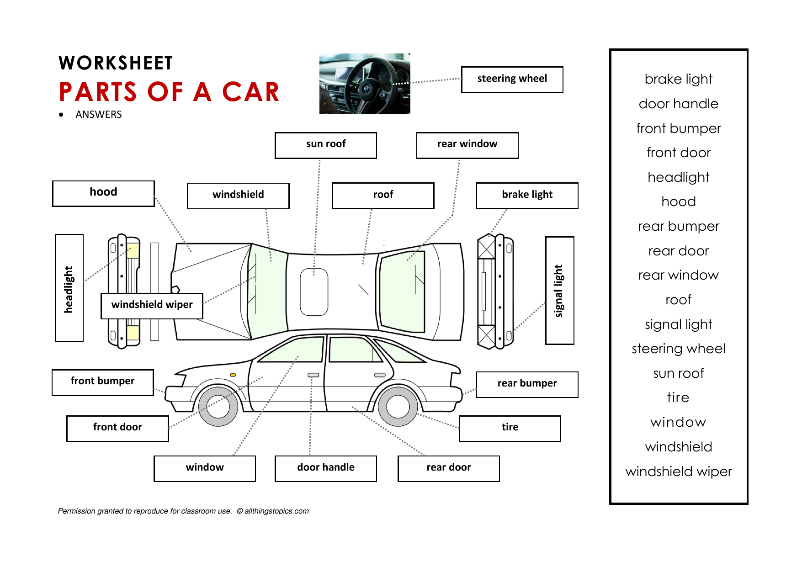
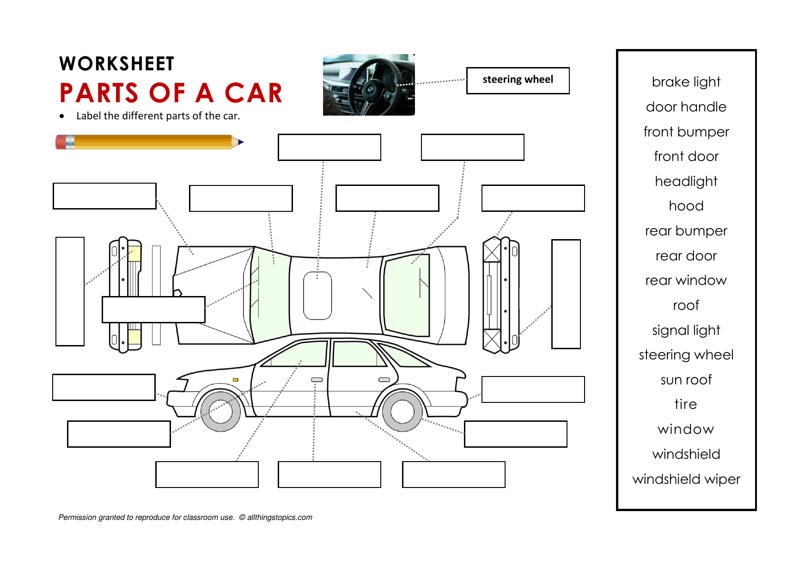

title: DRIVING (allthingstopics)
author: Rafael García (IES Virgen del Carmen)

## Speaking Practice: DRIVING

- [DRIVING](https://www.allthingstopics.com/driving.html)
- [Parts of a Car](https://www.allthingstopics.com/transportation.html)

### First: [do the quiz](driving-quiz.html "15 vocabulary items about driving") then check your answers

#### Drag the items to the correct blank spaces (the correct answers will appear once you drag the last item)

### Second: study the Parts of a Car

### Give your opinions about driving. 

### Each question must be answered by at least five students.

### Listen to the different opinions of your classmates.

### Debate with your classmates. 

### Give reasons why you agree or disagree with them.

## Parts of a Car (Memorize)

## Parts of a Car (Label)

# Do you know how to drive? If ‘yes’, when did you learn? When did you get your license?

# Do you think driving is fun? Why? / Why not?

# Are women better drivers than men?  Why? / Why not?

# What is the best age to learn how to drive?

# Do you think the driving age should be lowered?  Why? / Why not?

# Do you always use a seatbelt?  Why? / Why not?
	
# Do you think cars are a safe way to travel?  Why? / Why not?

# What is your favorite kind of car?  Describe it.

# What are three good things about driving a car?

# What are three bad things about driving a car?

# Compare driving and riding a motorcycle.

# What is a ‘traffic jam’?  What causes traffic jams?

# How will cars be different 100 years in the future?

# Do you think robotic ‘self-driving’ cars are a good idea?  Why? / Why not?

